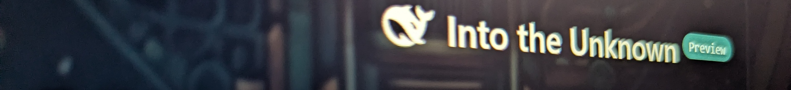

# Hi there 👋, I'm Bernd 

### 🚀 What drives me

I've been building software for 35 years — from PC applications to embedded systems, IoT, and SaaS. I've watched technology shift again and again, and I know one thing for sure: stand still, and you're done.

Started AI coding in 2024 - gone from _nice - but buggy_, to _fair_, _good_, _awesome_ to _holy shit flawless_. This is exponential growth.

---

### 🔥 What I do

* I'm using [Claude agents](https://github.com/weymann/openhab-claude) to develop full stack software 
* I'm using [Deep Seek Harness](https://github.com/deepseek-ai/deepseek-harness) & [Deep Seek GUI](https://github.com/See-Sol-Lab/DeepSeekGUI) to develop full stack software. My personal opinion: this becomes huge
* I'm [hosting LLMs](https://huggingface.co/) on my local AI server using [sglang](https://github.com/sgl-project/sglang) 
* I use them to analyse my [finances](https://github.com/weymann/dsh-playground/tree/main/dsh-depot-analysis) - stock portfolio, real estate, crypto & P2P lending assets
* I use them to maintain my [software portfolio](https://github.com/weymann/dsh-playground/tree/main/dsh-oh-issues) - bugs, new features and further enhancements
* I'm using [Tribuo](https://tribuo.org/) machine learning to forecast my energy consumption - household, hvac and battery electric vehicle

---

### ✨ What I'm developing

* Deep Seek Harness [Plugins](https://github.com/weymann/dsh-playground/tree/main/dsh-abstract-theme)
* [Agentic workflows for personal life](https://github.com/weymann/dsh-playground) - finance, taxes, smarthome and development
* [EEBus openHAB Integration](https://github.com/weymann/openhab-addons/tree/eebus/bundles/org.openhab.binding.eebus) based on [Fraunhofer OpenMUC libs](https://github.com/openmuc)
* [Home Energy Management System](https://github.com/weymann/openhab-addons/tree/curves/bundles/org.openhab.binding.curves) using several ML forecasts using Tribuo
* Smarthome frontend - [Widgets for openHAB](https://github.com/weymann/openhab-widgets) based on framework.io
* openHAB addons for **PV** - [E3DC (Modbus)](https://github.com/openhab/openhab-addons/tree/main/bundles/org.openhab.binding.modbus.e3dc), [Solarforecast](https://github.com/openhab/openhab-addons/tree/main/bundles/org.openhab.binding.solarforecast), [Tibber](https://github.com/openhab/openhab-addons/tree/main/bundles/org.openhab.binding.tibber), [ENTSO-E](https://github.com/openhab/openhab-addons/tree/main/bundles/org.openhab.binding.entsoe)
**Mobility** - [MercedesMe](https://github.com/openhab/openhab-addons/tree/main/bundles/org.openhab.binding.mercedesme)
**HVAC** - [Mitsubishi MELCloud Home](https://github.com/openhab/openhab-addons/tree/main/bundles/org.openhab.binding.melcloud), [Bosch Thermotechnology](https://github.com/weymann/OH-Drops/tree/main/boschthermotechnology)
**Home appliances** - [IKEA Homesmart](https://github.com/openhab/openhab-addons/tree/main/bundles/org.openhab.binding.dirigera) 
**Wellness** - [MSpa](https://github.com/openhab/openhab-addons/tree/main/bundles/org.openhab.binding.mspa) Whirlpools
* DIY projects to transform _ancient_ devices into modern IoT devices
**Combustion Cars** as [smart vehicles](https://github.com/weymann/torque2mqtt)
Analogue measurement devices into [smart-meters](https://github.com/weymann/smartmeter-gas) 

---

  
 

 

  
  
 

 

